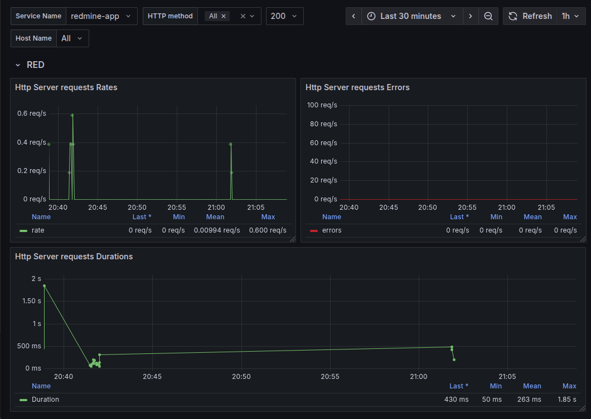

# 🚀 Despliegue Automatizado de Redmine: De Local a la Nube AWS

Este repositorio contiene el código para el despliegue automatizado de Redmine, mostrando su evolución desde un entorno local basado en Vagrant hasta una infraestructura robusta y automatizada en Amazon Web Services (AWS) utilizando una combinación de Terraform y Ansible.

<br/>

# ✨ Visión General del Proyecto

El proyecto aborda el desafío de desplegar Redmine de manera eficiente y consistente. Partiendo de una configuración manual con limitaciones, se ha evolucionado hacia una solución completamente automatizada basada en la Infraestructura como Código (IaC).

## Objetivos Clave:

- **Automatización Total**: Instalar y configurar Redmine de forma automatizada.

- **Despliegue en la Nube**: Realizar despliegues consistentes y fiables de Redmine en AWS.

<br/>

# 📂 Estructura del Repositorio

Este repositorio contiene el código de ambas partes del proyecto, organizado en dos directorios principales:

- `BETA-redmineAnsible/`: Contiene el código de la parte 1 (despliegue local de Redmine en una VM Vagrant).

- `infra/`: Contiene el código de la parte 2 (despliegue de infraestructura y Redmine en AWS).

<br/>

# 🚀 Guía Rápida de Despliegue

## Prepara el entorno virtual

Desde la raíz del proyecto (redmine-aws/) ejecuta:

```bash
python3 -m venv .venv
source ./.venv/bin/activate
pip install --upgrade pip # Actualizar pip version
pip install boto3 botocore ansible # Instalar Ansible aquí también
deactivate # Salir del venv para que los scripts de despliegue lo activen
```

## 🏠 Despliegue local con Vagrant

1. Dar Permisos de Ejecución a los Scripts `deploy-redmine-local.sh` y `destroy-local.sh`:

```bash
chmod +x deploy-redmine-local.sh
chmod +x destroy-local.sh
```

2. Ejecutar el Script `deploy-redmine-local.sh`:

```bash
./deploy-redmine-local.sh
```

3. 🔑 Acceso SSH

Conéctate a la VM:

```bash
cd /BETA-redmineAnsible # si aún no estas en el directorio
vagrant ssh
```

## ☁️ Despliegue en AWS

1. Dar Permisos de Ejecución a los Scripts `deploy-redmine-aws.sh` y `destroy-aws.sh`:

```bash
chmod +x deploy-redmine-aws.sh
chmod +x destroy-aws.sh
```

2. Ejecutar el Script `deploy-redmine-aws.sh`:

```bash
./deploy-redmine-aws.sh
```

3. 🔑 Acceso SSH

Conéctate a la instancia EC2 usando tu clave privada y la IP obtenida:

```bash
ssh -i ~/.ssh/id_ed25519 admin@<IP_PUBLICA_EC2>
```

<br/>

# 🧹 Limpieza

Para destruir todos los recursos creados ejecutar el script:

```bash
./destroy-local.sh  # Si hiciste deploy local con Vagrant
./destroy-aws.sh  # Si hiciste deploy en AWS
```

> Se requerirá confirmación manual, escribe `yes` cuando se te solicite.

<br/>

# 🔍 Observabilidad con OpenTelemetry y Grafana Cloud

Este proyecto incluye configuración completa de observabilidad usando OpenTelemetry para enviar trazas y métricas a Grafana Cloud, proporcionando visibilidad total del comportamiento y rendimiento de Redmine.



## ⚙️ Configuración Requerida

Antes del despliegue, configura las variables necesarias para OpenTelemetry en `BETA-redmineAnsible/vars/secrets.yml`:

```yml
grafana_tempo_api_token: "tu_api_token_tempo"
grafana_metrics_api_token: "tu_api_token_metrics" # Opcional para métricas
redmine_otel_service_name: "redmine"
redmine_environment: "production"
```

## ¿Qué se despliega automáticamente?

- **OpenTelemetry Collector**: Recolecta y envía trazas (y métricas opcionales) a Grafana Cloud
- **Instrumentación Ruby**: Genera trazas automáticamente desde la aplicación Redmine
- **Configuración automática**: Scripts y configuración para integración completa

## Verificación del Despliegue

### 1. Verificar que OpenTelemetry Collector está ejecutándose:

```bash
sudo systemctl status otel-collector
```

### 2. Verificar logs del collector:

```bash
sudo journalctl -u otel-collector -f
```

### 3. Acceder a Grafana Cloud:

- Ve a tu instancia de Grafana Cloud
- Navega a **Explore** > **Tempo** para ver trazas
- Busca trazas del servicio "redmine-app"

## 🔧 Troubleshooting

**Si no ves trazas:**

1. Verifica que el token de Grafana Tempo sea válido
2. Revisa los logs del collector con el comando anterior
3. Confirma que Redmine esté generando tráfico (accede a algunas páginas)

**Para métricas (opcional):**

- Las métricas RED se pueden generar desde las trazas en Grafana
- O habilitar el exporter `prometheusremotewrite/grafanacloud_metrics` en la configuración.
